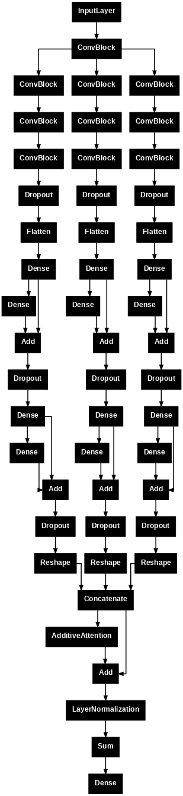

# Distinguishing individuals based on their EEG signals using an attention-supported tribrid ConvNet
## Project description

The goal of this project was to train a convolutional neural network to classify EEG signals as belonging to one of two individuals performing the same task (counting squares of a chosen color). 

Models were trained for 7 randomly selected pairs of subjects, using 2 different data folds per pairing and the model architecture described below. 

## Dataset

[UC Berkeley-Biosense Synchronized Brainwave Dataset](https://www.kaggle.com/datasets/berkeley-biosense/synchronized-brainwave-dataset)

The dataset contains 1-second windows of single-channel EEG readings sampled at 512 Hz. The signals were recorded using a consumer-grade headset with a single-electrode
while the subjects responded to different types of stimuli. 

## Data Augmentation

To increase the number of available training samples, a cropped training strategy inspired by Schirrmeister et al. (2017) was used. For each subject, all samples recorded during the 
"colorRound" stimulus were concatenated in chronological order. New 1-second samples were then generated as sliding time windows, such that the start and end of each sample i+1 
was shifted by 375 ms in relation to sample i.

<i>Figure 1. The first 3 original samples recorded for subject {subj_id} during the color task are shown in the first subplot; 
followed by subplots displaying the first 3 training samples generated by the cropping process (offset={offset} ms). 
Dotted pink lines in the first subplot mark the original sample borders. EEG values have been scaled to fall in the [-0.5, 0.5] range.</i>

## Model Architecture

Models with larger kernel sizes in the convolutional layers were found to be more powerful but have extremely high variance. 
It was found that more stable results could be achieved by using a "tribrid" architecure which allowed for a low-level representation 
of the input to flow through three different processing paths. These paths had the same overall architecture - four 2-layer convolutional blocks followed by two blocks of dense layers -
but different kernel sizes in the convolutional layers. 

The outputs of the processing paths were concatenated, and additive (self) attention was applied, before they were merged by summation.  
The idea was for the paths to "collaborate" by focusing on different features in the input, but taking into account their counterparts' representations.

## Performance

|metric         |subj. 3 & 7 |subj. 1 & 27 |subj. 8 & 4 |subj. 7 & 28 |subj. 7 & 1 |subj. 1 & 28 |subj. 6 & 18|
|---------------|------------|-------------|------------|-------------|------------|-------------|------------|
|binary_accuracy|0.722200    |0.828900 	   |0.881600 	|0.802600     |0.684200    |0.631600 	 |0.947400    |
|precision 	|0.750800    |0.842400 	   |0.836600 	|0.756000     |0.751300    |0.625000 	 |0.928600    |
|recall 	|0.710500    |0.815800 	   |0.947400 	|0.894700     |0.552600    |0.657900 	 |0.973700    |

<i>Table 1. Results for subject pairings; averaged over folds</i>

## Contents of the Repository

notebooks:

 - *EEG_data_inspection.ipynb*: exploratory data analysis

 - *EEG_subject_classification*: contains the code for data augmentation and the classifier

plots:

 - *data_augmentation_example.png*

 - *model_architecture_plot.png*

## Dependencies

 - pandas 2.2.2

 - numpy 1.26.4

 - matplotlib 3.10.0

 - keras 3.8.0

 - tensorflow 2.18.0

## References

Chuang, J., Merrill, N., Maillart, T., & Students of the UC Berkeley Spring 2015 MIDS Immersion Class. (2015, May 9). 
*Synchronized Brainwave Recordings from a Group Presented with a Common Audio-Visual Stimulus*. UC Berkeley Spring 2015 MIDS Immersion Class.

Mukherjee, S. (2022, November 5). *Electroencephalogram Signal Classification for action identification*. https://keras.io/examples/timeseries/eeg_signal_classification/

Schirrmeister, R. T., Springenberg, J. T, Fiederer, L. D. J., Glasstetter, M., Eggensperger, K., Tangermann, M., Hutter, F., Burgard, W., & Ball, T. (2017). 
Deep Learning With Convolutional Neural Networks for EEG Decoding and Visualization. *Human Brain Mapping, 38*(5), 5391–5420. 
